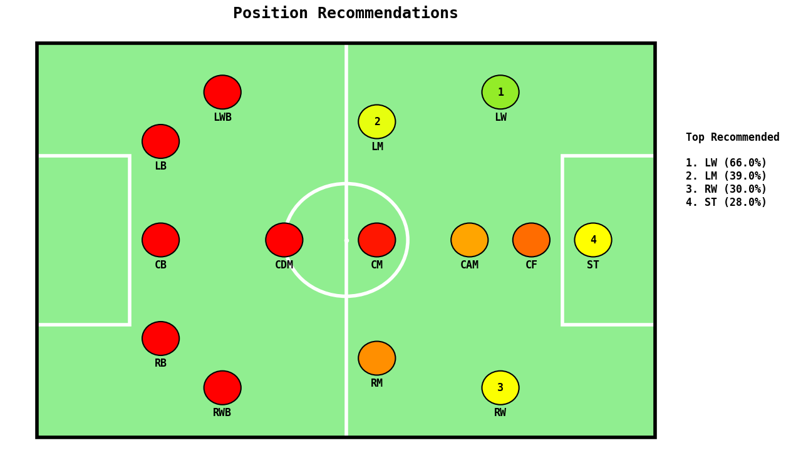

# Position Recommendations for Footballers Using Python and Scikit-learn


**[My Project Jupyter Notebook](https://github.com/subhakritsc/Position-Recommendations-for-Footballers/blob/main/Football%20Position%20Recommendations.ipynb)**

## Python Libraries Used
- Pandas
- NumPy
- Scikit-learn
- Joblib
- Matplotlib
- Streamlit

## Objective

This project aims to help football players and coaches select the most suitable playing position for a player based on their physical attributes and skills. Using machine learning techniques, the model selects and ranks the best positions for a player, assisting in optimal team selection and player development.


## Dataset

The project uses two datasets for model training and testing:

1. [EA Sports FC 24 Complete Player Dataset](https://www.kaggle.com/datasets/stefanoleone992/ea-sports-fc-24-complete-player-dataset) by [Stefano Leone](https://www.kaggle.com/stefanoleone992): Used for **Training** the model.

2. [EA SPORTS FC 25 DATABASE, RATINGS AND STATS](https://www.kaggle.com/datasets/nyagami/ea-sports-fc-25-database-ratings-and-stats) by [Davis Nyagami](https://www.kaggle.com/nyagami): Used for **Testing** the model and visualization.


## Key Steps in the project

1. **Data Cleaning and Feature Extraction**:
    - **Data Filtering**: Excluded goalkeepers and selected FIFA versions 22-24.
    - **Position Encoding**: Converted player positions into binary vectors.
    - **Feature Engineering**: Calculated BMI, normalized skills, and created category averages (offensive, defensive, physical, etc.).
    - **Additional Features**: Added attacking/defensive contributions and ratio.

2. **Selecting and Training the Machine Learning Model**:
    - **Model Selection**: Chose **Random Forest** for multilabel classification, as it handles multiple outputs, reduces overfitting, provides feature importance insights, and is scalable with large datasets.
    - **Data Splitting**: Split data into training (80%) and testing (20%) sets using `train_test_split`.
    - **Model Training**: Trained a `RandomForestClassifier` with 100 estimators, using `MultiOutputClassifier` to handle multilabel classification.
Feature Importance Extraction: Averaged feature importances from all trees to identify key features influencing position predictions.

3. **Evaluating the Machine Learning Model**:
    - **Creating Function to Recommend Player Positions**: Defined a `select_and_sort()` function using the model trained in Step 2 to recommend player positions. The function uses the model to calculate suitable percentages for each position based on player features, sorts the positions by their suitability, and returns a ranked list of positions along with their corresponding percentages.
    - **Model Accuracy Evaluation**: Evaluated the model's performance by comparing the top recommended position with the player’s actual positions. A recommendation was considered correct if the top recommended position matched any of the player’s actual positions. The accuracy was calculated as the ratio of correct recommendations to the total number of recommendations in a subset of test data.
      ```
        Accuracy (Top recommended position in actual positions, subset of 200): 0.925
      ```
      
4. **Using the Machine Learning Model for Position Recommendations Based on Player's Input Data**:
    - **Creating Function to Collect and Transform Player Data from Keyboard Input**: Defined a `get_player_input()` function to collect player input from the keyboard based on the format provided in [EA Sports FC Official Ratings](https://www.ea.com/games/ea-sports-fc/ratings). The function processes the collected input, transforms it into a format compatible with the model's feature requirements.
    - **Generating Position Recommendations for a Player from Keyboard Input**: Used the `select_and_sort()` function (defined in Step 3) to recommend player positions based on keyboard input.
   
5. **Output Visualization**:
   - **Filtering Unfound Positions**: Filtered out positions that did not appear in the dataset to exclude them from visualization (e.g., `LS`, `RDM`, `LAM`, `RCB`, etc.).
   - **Pitch Setup**: Used `matplotlib.patches` to plot a football pitch with a rectangular field, penalty boxes, and a center circle.
   - **Position Plotting**: Defined player positions and their coordinates on the pitch, representing typical player placements on the field.
   - **Color Coding for Position Suitability**: Used a custom algorithm to assign colors based on position suitability to create a meaningful visualization. Positions with higher suitability are assigned greener shades, while lower suitability is represented with warmer colors like red and orange, ensuring that the color scheme reflects the suitability of positions effectively.
   - **Rankings and Labels**: Displayed a ranked list of top recommended positions with suitable percentages next to the pitch, with rankings also shown directly on the pitch.
     
     

6. **Building a Web Interface with Streamlit**:
   - **Creating Function to Collect and Transform Player Data from Web Input**: Defined a `get_player_input_streamlit()` function to collect player input from the web interface using Streamlit widgets (e.g., `sliders`, `number_input`, `feedback`, `selectbox`, etc.). The function processes the collected input, transforms it into a format compatible with the model's feature requirements.
   - **Generating Position Recommendations for a Player from Web Input**: Used the `select_and_sort()` function (defined in Step 3) to recommend player positions based on web input.
   - **Output Visualization on Web Interface**: Used the visualizations from Step 5, including the football pitch plot and color-coded position suitability, to display the results on the Streamlit interface.
  
     

## Future Enhancements

- **Simplified Input Options**: Add a fast entry option for casual users to make the process quicker and easier.
- **Deep Learning Integration**: Implement advanced models to provide more accurate and detailed predictions.
- **Team Analysis**: Expand features to optimize team formations and tactical strategies.


## Acknowledgments

- [Stefano Leone](https://www.kaggle.com/stefanoleone992) for EA Sports FC 24 Complete Player Dataset
- [Davis Nyagami](https://www.kaggle.com/nyagami) for EA SPORTS FC 25 DATABASE, RATINGS AND STATS
- [EA Sports FC Official Ratings](https://www.ea.com/games/ea-sports-fc/ratings) for the input format and player ratings structure.


